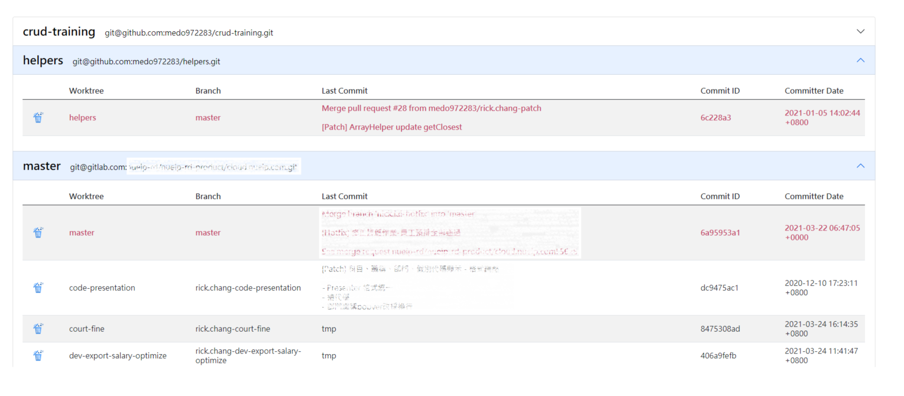

# PHP Web Tool For Tracing Worktree Status

This project provides a light PHP web tool to collect all the basic git info of the repository and its worktrees, then separately visualize it in the HTML table of the different repository.

## Supported Directory Structure

Because of my work environment limit, I can only store several repositories and their worktrees under the same directory. The following is the directory structure tree.

```text
└── Root
    ├── <<This project>>
    ├── Repository A
    ├── worktree1 from A
    ├── worktree2 from A
    └── Repository B
```

## Related

Backend|Version
-------|-------
PHP    | >= 7.0

FrontEnd Dependency| Version
---                |---
Bootstrap CDN      | v5.0.0
jQuery CDN         | v3.5.1

## Display

